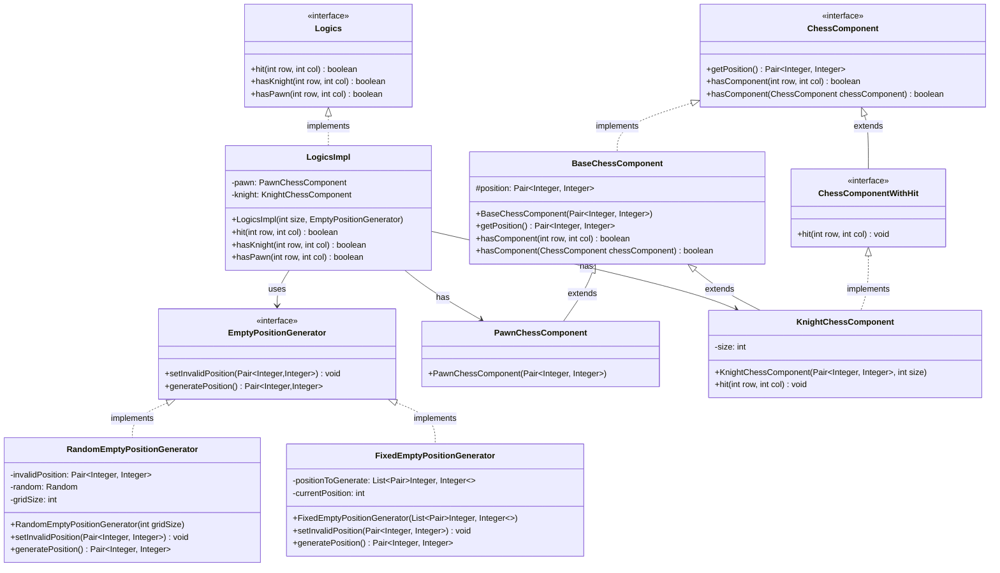

```mermaid

classDiagram

    class Logics {
        <<interface>>
        +hit(int row, int col) boolean
        +hasKnight(int row, int col) boolean
        +hasPawn(int row, int col) boolean
    }

    class ChessComponent {
        <<interface>>
        +getPosition() Pair~Integer, Integer~
        +hasComponent(int row, int col) boolean
        +hasComponent(ChessComponent chessComponent) boolean
    }

    class ChessComponentWithHit {
        <<interface>>
        +hit(int row, int col) void
    }

    class EmptyPositionGenerator {
        <<interface>>
        +setInvalidPosition(Pair~Integer,Integer~) void
        +generatePosition() Pair~Integer,Integer~
    }

    class LogicsImpl {
        -pawn: PawnChessComponent
        -knight: KnightChessComponent
        +LogicsImpl(int size, EmptyPositionGenerator)
        +hit(int row, int col) boolean
        +hasKnight(int row, int col) boolean
        +hasPawn(int row, int col) boolean
    }

    class BaseChessComponent {
        #position: Pair~Integer, Integer~
        +BaseChessComponent(Pair~Integer, Integer~)
        +getPosition() Pair~Integer, Integer~
        +hasComponent(int row, int col) boolean
        +hasComponent(ChessComponent chessComponent) boolean
    }

    class PawnChessComponent {
        +PawnChessComponent(Pair~Integer, Integer~)
    }

    class KnightChessComponent {
        -size: int
        +KnightChessComponent(Pair~Integer, Integer~, int size)
        +hit(int row, int col) void
    }

    class RandomEmptyPositionGenerator {
        -invalidPosition: Pair~Integer, Integer~
        -random: Random
        -gridSize: int
        +RandomEmptyPositionGenerator(int gridSize)
        +setInvalidPosition(Pair~Integer, Integer~) void
        +generatePosition() Pair~Integer, Integer~
    }

    class FixedEmptyPositionGenerator {
        -positionToGenerate: List~Pair~Integer, Integer~~
        -currentPosition: int
        +FixedEmptyPositionGenerator(List~Pair~Integer, Integer~~)
        +setInvalidPosition(Pair~Integer, Integer~) void
        +generatePosition() Pair~Integer, Integer~
    }

    Logics <|.. LogicsImpl : implements
    ChessComponent <|.. BaseChessComponent : implements
    ChessComponent <|-- ChessComponentWithHit : extends
    ChessComponentWithHit <|.. KnightChessComponent : implements
    BaseChessComponent <|-- PawnChessComponent : extends
    BaseChessComponent <|-- KnightChessComponent : extends
    LogicsImpl --> PawnChessComponent : has
    LogicsImpl --> KnightChessComponent : has
    LogicsImpl --> EmptyPositionGenerator : uses
    EmptyPositionGenerator <|.. RandomEmptyPositionGenerator : implements
    EmptyPositionGenerator <|.. FixedEmptyPositionGenerator : implements

```
